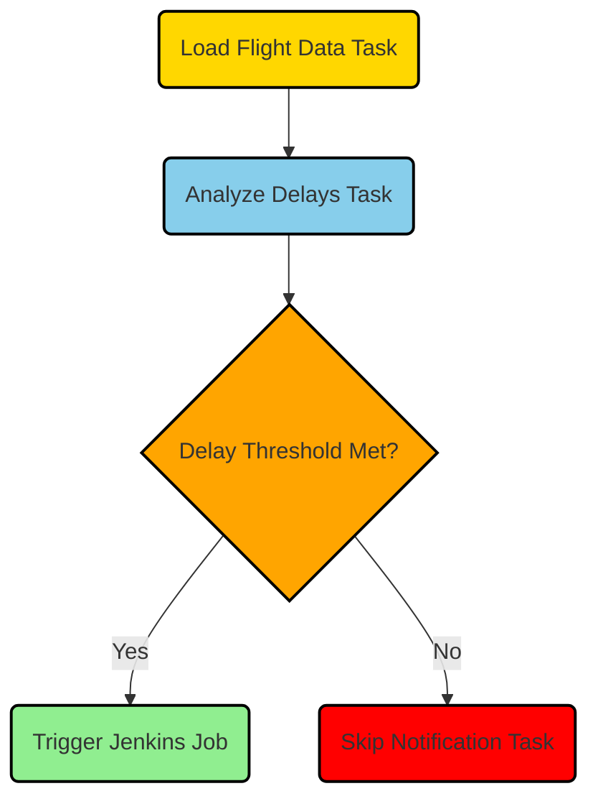

Flight Checker
--------------

This Python script is part of an Apache Airflow DAG that checks flight information for delays and cancellations, performs data analysis, creates a CSV report, and triggers a Jenkins job.

### Overview

The script consists of two main classes: `FlightChecker` and `DelayedApiCallSensor`. These classes interact with flight information from an API and perform a series of operations. The DAG is defined with tasks that load flight data, analyze delays, create a CSV file, and trigger a Jenkins job.

### 1\. `FlightChecker` Class

The `FlightChecker` class is responsible for handling flight-related operations. It performs the following tasks:

* **Validation**: It validates the presence and validity of required environment variables.
* **Loading Flight Data**: It retrieves flight data from the API and stores it in Airflow's XCom for inter-task communication.
* **Analyzing Delays**: It analyzes flight delays for each airport and performs appropriate actions, such as logging delayed or cancelled flights and updating the last delay print time.
* **Creating CSV File**: It creates a CSV file containing flights that meet the specified conditions.
* **Notification**: It notifies a plugin or external service about flight status changes. The current implementation logs the notification details.

### 2\. `DelayedApiCallSensor` Class

The `DelayedApiCallSensor` class is a custom Airflow sensor that determines when to make the next API call based on ongoing delays and the current time of day. It checks whether the conditions for making the API call are met and returns `True` or `False` accordingly.

### 3\. Airflow DAG

The DAG is defined with the following tasks:

* **Load Flight Data Task**: This task uses the `PythonOperator` to execute the `load_flight_data` function from the `FlightChecker` class. It retrieves flight data from the API and stores it in XCom.
* **Analyze Delays Task**: This task uses the `PythonOperator` to execute the `analyze_delays` function from the `FlightChecker` class. It analyzes flight delays based on the retrieved data and performs appropriate actions.
* **Create CSV File Task**: This task uses the `PythonOperator` to execute the `create_csv_file` function from the `FlightChecker` class. It creates a CSV file containing flights that meet the specified conditions.
* **Trigger Jenkins Job Task**: This task uses the `JenkinsJobTriggerOperator` to trigger a specific Jenkins job. It specifies the job name, Jenkins connection, and other parameters.

The tasks are sequenced using the bitshift operator (`>>`) to define the order of execution.

### Environment Variables

The script uses environment variables to configure various parameters. Here are the environment variables used:

* `FLIGHTS_API_KEY`: API key for accessing flight data.
* `AIRPORTS`: Comma-separated list of airport codes.
* `AIRLINES`: Comma-separated list of airline codes.
* `DELAY_THRESHOLD`: Threshold for considering a flight as delayed (in minutes).
* `TIME_TO_DEPARTURE_THRESHOLD`: Threshold for considering a flight as delayed only if it departs after a certain time (in minutes).
* `CANCELLED_FLIGHT_TIME_WINDOW_START`: Start time of the window to consider a flight as cancelled if it's within this window after the last delay (in minutes).
* `CANCELLED_FLIGHT_TIME_WINDOW_END`: End time of the window to consider a flight as cancelled if it's within this window after the last delay (in minutes).
* `API_HOST`: Host URL for the flight data API.
* `API_ENDPOINT`: API endpoint for retrieving flight data.
* `IGNORED_DESTINATIONS_BCN`: Comma-separated list of ignored destinations for the airport with code "BCN".
* `IGNORED_DESTINATIONS_AMS`: Comma-separated list of ignored destinations for the airport with code "AMS".
* `JENKINS_URL`: URL of the Jenkins server.
* `JENKINS_USERNAME`: Username for accessing Jenkins.
* `JENKINS_JOB_NAME`: Name of the Jenkins job to trigger.
* `JENKINS_TOKEN`: Token for authenticating with Jenkins.
* `JENKINS_CONNECTION_ID`: Connection ID for accessing Jenkins.

Other environment variables related to API retries, CSV file settings, API call timing, DAG settings, Jenkins parameters, and Jenkins job triggering are also used.

Make sure to set these environment variables with appropriate values before running the script.

Note: Comments have been added to the environment variables in the code for better understanding.

